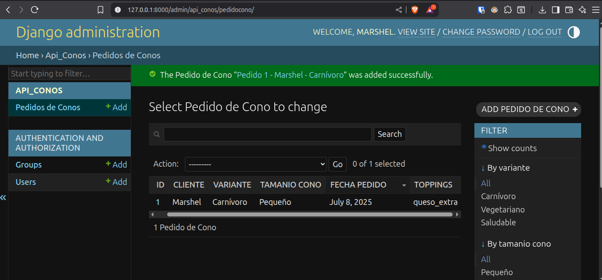
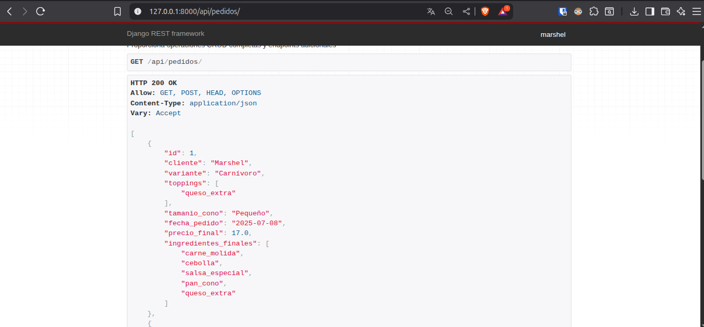

# Parcial 2 - API de Pedidos de Conos

*   **Nombre:** Marshel Aillón
*   **Materia:** Programación 2
*   **Fecha:** 07/07/2025 

---

## Descripción del Proyecto

Esta API REST, desarrollada con Django y Django REST Framework, permite gestionar pedidos de conos personalizados. La lógica de negocio para calcular los precios e ingredientes de los conos se ha implementado utilizando patrones de diseño de software (`Factory Method`, `Builder` y `Singleton`) para garantizar un código desacoplado, mantenible y extensible.

---

## Aplicación de Patrones de Diseño

A continuación se detalla cómo se aplica cada patrón de diseño en el método `construir_cono_completo` del `ConoDirector`, que es el punto central de la lógica de negocio.

### 1. Factory Method

**Propósito:** Crear un objeto base sin exponer la lógica de creación al cliente y permitiendo que las subclases decidan qué clase instanciar.

**Aplicación en el proyecto:**

El patrón `Factory Method` se utiliza para crear el "cono base" según la variante seleccionada por el cliente ('Carnívoro', 'Vegetariano', 'Saludable').

El método `ConoDirector.construir_cono_completo` invoca a la fábrica:

```python
# api_conos/patterns.py

class ConoDirector:
    def construir_cono_completo(...):
        # 1. Factory Method: Crear cono base
        cono_base = self.factory.crear_cono(variante, tamanio)
        # ...
```

La clase `ConoFactory` contiene el método estático `crear_cono`, que actúa como la fábrica. Este método recibe la `variante` y el `tamanio` y devuelve una instancia del cono correspondiente (`ConoCarnivoro`, `ConoVegetariano`, etc.), cada uno con sus propios ingredientes y precios base.

```python
# api_conos/patterns.py

class ConoFactory:
    @staticmethod
    def crear_cono(variante: str, tamanio: str) -> ConoBase:
        if variante == "Carnívoro":
            return ConoCarnivoro(tamanio)
        elif variante == "Vegetariano":
            return ConoVegetariano(tamanio)
        # ...
```

De esta manera, el `ConoDirector` no necesita saber cómo se construye cada tipo de cono; simplemente le pide a la fábrica que le entregue el producto base correcto.

### 2. Builder

**Propósito:** Construir un objeto complejo paso a paso, separando el proceso de construcción de su representación final.

**Aplicación en el proyecto:**

Una vez que la fábrica ha creado el cono base, el patrón `Builder` se encarga de personalizarlo. El `ConoBuilder` toma el `cono_base` y le añade los toppings y aplica descuentos de forma secuencial.

El `ConoDirector` orquesta este proceso:

```python
# api_conos/patterns.py

class ConoDirector:
    def construir_cono_completo(...):
        # ... (Factory crea el cono_base)

        # 2. Builder: Personalizar el cono
        builder = ConoBuilder(cono_base)
        resultado = builder.agregar_toppings(toppings).aplicar_descuento_combo().build()

        return resultado
```

El `ConoBuilder` tiene métodos encadenables (`agregar_toppings`, `aplicar_descuento_combo`) que modifican el objeto `cono` que contiene. Finalmente, el método `build()` devuelve un diccionario con el resultado final (`precio_final`, `ingredientes_finales`). Esto permite añadir más pasos de personalización en el futuro sin alterar el director ni el producto final.

### 3. Singleton

**Propósito:** Garantizar que una clase tenga una única instancia y proporcionar un punto de acceso global a ella.

**Aplicación en el proyecto:**

El patrón `Singleton` se utiliza en la clase `OperationLogger` para tener un registro centralizado de todas las operaciones de cálculo que ocurren en el sistema.

Tanto el `ConoDirector` como el `ConoBuilder` acceden a la misma instancia del logger para registrar cada paso del proceso: la creación del cono base, la adición de cada topping y la aplicación de descuentos.

```python
# api_conos/patterns.py

class ConoDirector:
    def __init__(self):
        self.logger = OperationLogger() # Obtiene la única instancia

    def construir_cono_completo(...):
        # ...
        self.logger.log_operation("CREATE_BASE_CONO", pedido_id, ...)
        # ...

class ConoBuilder:
    def __init__(self, cono_base: ConoBase):
        self.cono = cono_base
        self.logger = OperationLogger() # Obtiene la misma instancia
```

Esto asegura que todos los logs se almacenen en un solo lugar de forma segura (gracias al `threading.Lock`), y puedan ser consultados a través de un único punto de acceso, como se hace en el endpoint `/api/pedidos/logs_operaciones/` del `PedidoConoViewSet`.

____

#### Screenshots



___

